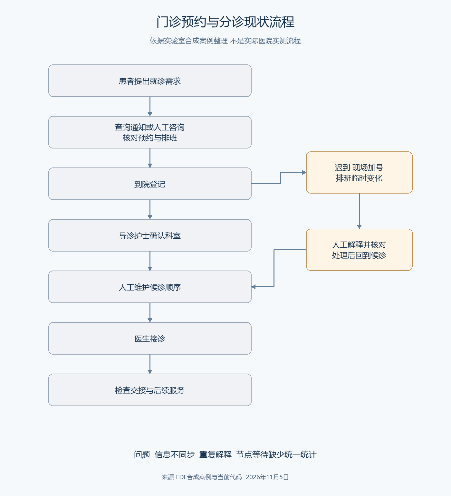
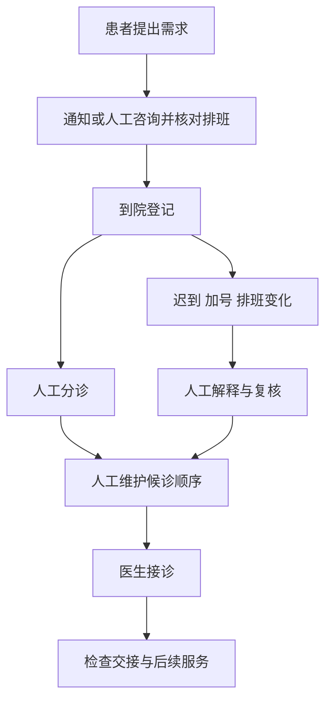
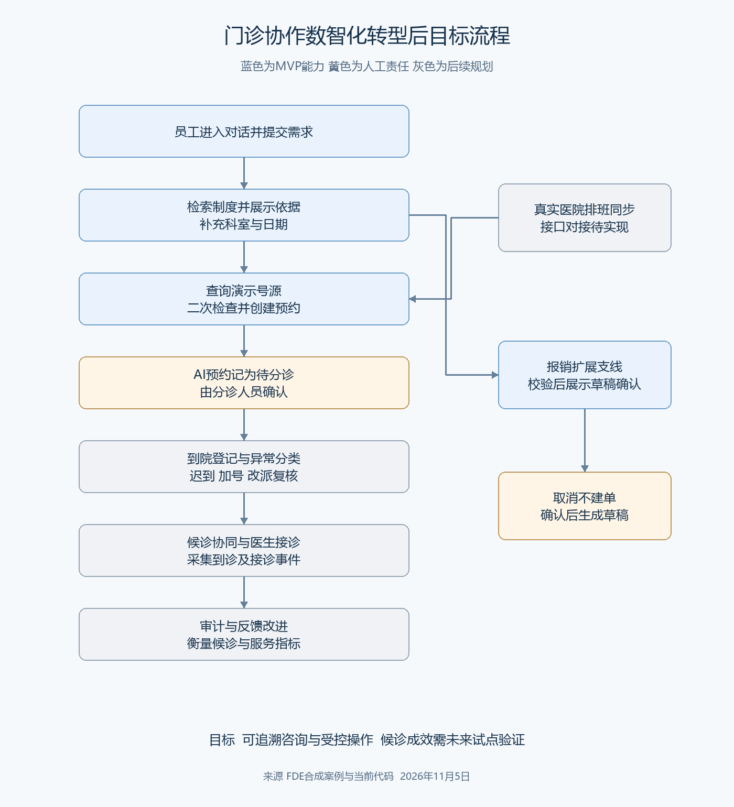
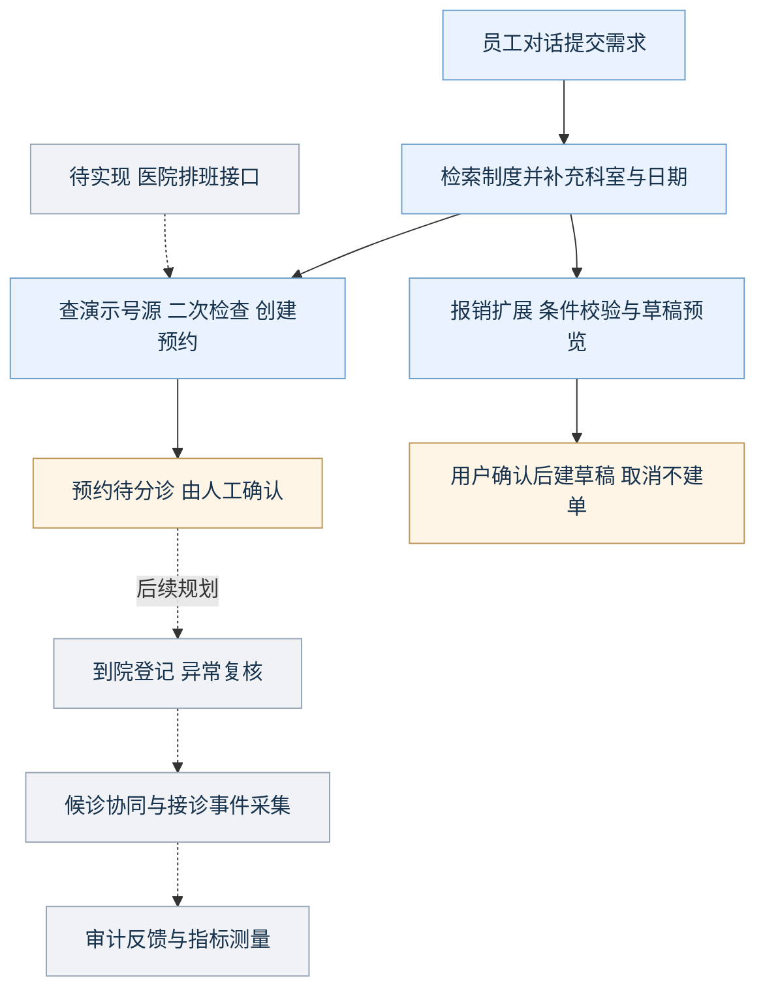

# 现状与数智化转型后流程

现状基于实验室合成案例的访谈事实整理。转型后图是目标方案，蓝色为当前MVP、黄色为人工责任、灰色为后续规划，不将医院集成和候诊调度写成已上线功能。

## 现状流程

```mermaid
flowchart TD
 A[患者提出需求] --> B[通知或人工咨询并核对排班]
 B --> C[到院登记] --> D[人工分诊] --> E[人工维护候诊顺序]
 C --> X[迟到 加号 排班变化] --> Y[人工解释与复核] --> E
 E --> F[医生接诊] --> G[检查交接与后续服务]
```

## 转型后目标流程

```mermaid
flowchart TD
 A[员工对话提交需求] --> B[检索制度并补充科室与日期]
 B --> C[查演示号源 二次检查 创建预约]
 C --> D[预约待分诊 由人工确认]
 D -.后续规划.-> E[到院登记 异常复核] -.-> F[候诊协同与接诊事件采集]
 F -.-> G[审计反馈与指标测量]
 H[待实现 医院排班接口] -.-> C
 B --> R[报销扩展 条件校验与草稿预览]
 R --> U[用户确认后建草稿 取消不建单]
 classDef done fill:#eaf3fd,stroke:#6d9fcb,color:#18334d
 classDef human fill:#fff5e6,stroke:#bd965c,color:#18334d
 classDef future fill:#f0f2f5,stroke:#97a5b5,color:#18334d
 class A,B,C,R done
 class D,U human
 class E,F,G,H future
```

可编辑矢量源文件：[现状SVG](03_现状流程图.svg) / [转型后SVG](03_转型后目标流程图.svg)。
